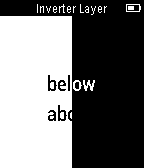

# feature-inverter-layer

This example shows how to use the [`InverterLayer`](https://developer.getpebble.com/docs/c/group___inverter_layer.html) to invert an area in a graphics context to make the black pixels white and vice versa.
